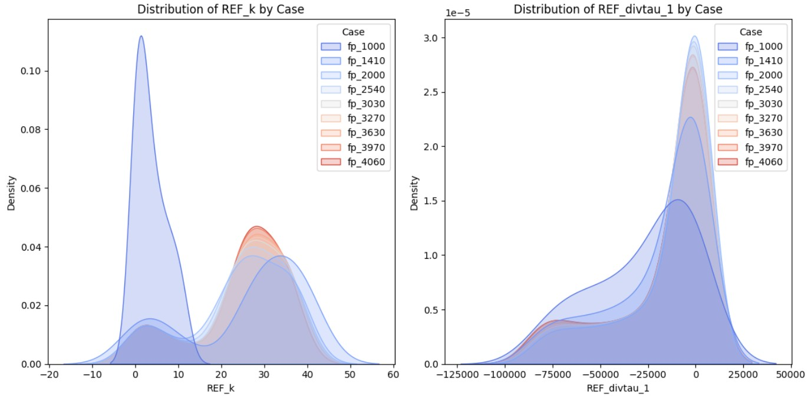
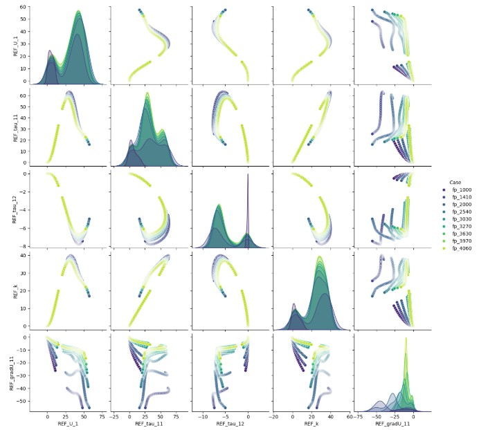
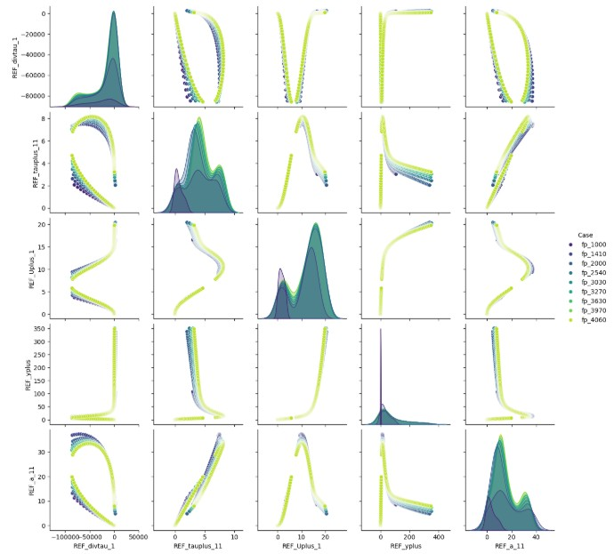
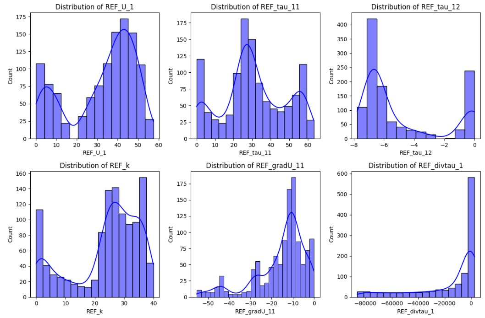
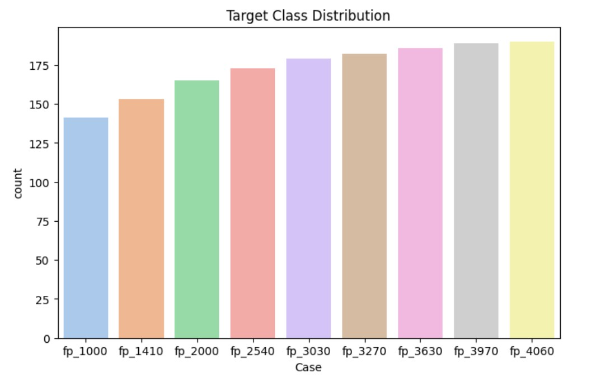
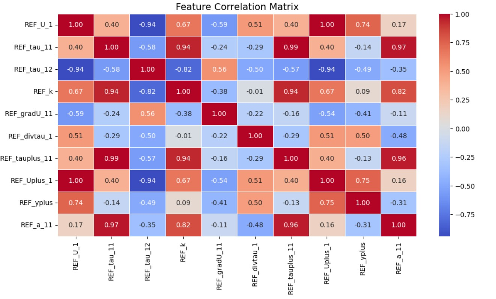

# FlowNet: AI Model for Fluid Simulation Optimization

## Project Overview
FlowNet is an AI-driven model designed to optimize fluid dynamics in industrial processes. By integrating machine learning algorithms with Computational Fluid Dynamics (CFD) results, FlowNet predicts and optimizes fluid behavior in real-time. This project aims to enhance system reliability, improve predictive maintenance, and optimize flow management without requiring full CFD simulations for every operational step.

## Objective
The primary goals of FlowNet are:
- **Predict fluid flow anomalies** in real-time to enhance system reliability.
- **Optimize fluid flow patterns** to reduce energy consumption and operational costs.
- **Improve predictive maintenance** by forecasting potential failures or inefficiencies.
- **Adapt dynamically** to changes in fluid behavior (e.g., temperature, flow rate, pressure) to improve industrial system performance.

## Dataset
- **File:** `cleaned_REF.csv`
- **Dataset Source:** [ML Turbulence Dataset](https://www.kaggle.com/datasets/ryleymcconkey/ml-turbulence-dataset)
- **Initial Dataset Size:** `902,812 rows × 49 columns`
- **After Cleaning:** `1,558 rows × 11 columns`
- **Target Variable:** `Case`
- **Selected Features:**
  - `REF_U_1`
  - `REF_tau_11`
  - `REF_tau_12`
  - `REF_k`
  - `REF_gradU_11`
  - `REF_divtau_1`
  - `REF_tauplus_11`
  - `REF_Uplus_1`
  - `REF_yplus`
  - `REF_a_11`
- **Preprocessing Steps:**
  - Removal of outliers
  - Normalization of values
  - Feature engineering to extract critical fluid behavior characteristics

## Technologies and Tools Used
- **Machine Learning Frameworks:** TensorFlow, Keras, Scikit-learn, PyTorch
- **Data Processing:** Pandas, NumPy
- **Anomaly Detection Algorithms:** Random Forests, SVMs, Isolation Forests
- **Optimization Algorithms:** Reinforcement Learning, Genetic Algorithms
- **Real-Time Data Integration:** MQTT, WebSockets, RESTful APIs

## Visualizations
FlowNet includes various visualizations to analyze and compare model performance. Below are the key visualizations:

### 1. **Distribution Plots of 'REF_k' and 'REF_divtau_1' by Class**
- Helps understand feature distribution across target classes.

### 2. **Pairplot for the First 5 Features**
- Visualizes relationships between the first five selected features.

### 3. **Pairplot for the Next 5 Features**
- If applicable, explores correlations between the next five selected features.

### 4. **Class Distribution Check**
- Ensures balanced representation across different classes.

### 4. **Target Class Distribution**
- Display all classes to the target.

### 5. **Correlation Matrix**
- Displays feature correlations to identify redundant or highly correlated variables.

## Model Evaluation
- **Metrics Used:** Accuracy, Precision, Recall, F1-score
- **Performance Testing:**
  - Real-time anomaly detection
  - Energy savings assessment
  - System reliability evaluation

## Model Performance Comparison
| Model                 | Accuracy | Precision (Avg) | Recall (Avg) | F1-Score (Avg) |
|----------------------|----------|----------------|-------------|---------------|
| **Random Forest**     | **69.87%** | 71% | 70% | 70% |
| **Decision Tree**     | 67.63% | 68% | 68% | 67% |
| **XGBoost**          | 67.30% | 69% | 68% | 68% |
| **Logistic Regression** | 58.33% | 64% | 58% | 60% |
| **SVM**              | 39.74% | 42% | 42% | 41% |

### Key Observations
- **Random Forest** performed the best, achieving the highest accuracy (69.87%) and strong precision, recall, and F1-score values.
- **Decision Tree and XGBoost** models performed similarly (~67% accuracy), making them reliable choices.
- **Logistic Regression** had moderate performance (58.33% accuracy) but struggled with recall and F1-score.
- **SVM** had the lowest accuracy (39.74%) and poor performance across all metrics, making it the least effective model.

## Deployment
FlowNet can be deployed as an API or cloud-based solution for real-time predictions and optimizations. Instructions for integrating with industrial systems (e.g., SCADA platforms, IoT sensors) are provided in `deployment/README.md`.

## Contributor
- **Name:** [Md. Jisan Ahmed]
- **Email:** [jisan3325@gmail.com]

## License
This project is licensed under the MIT License - see the LICENSE file for details.

